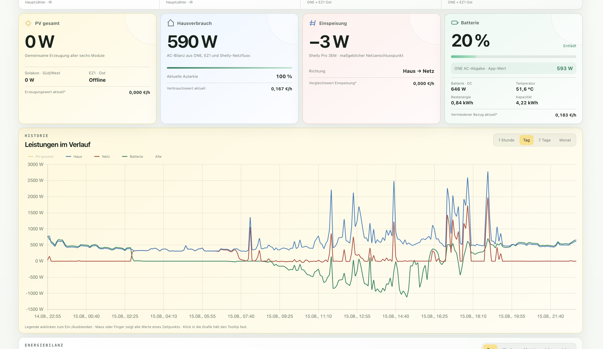
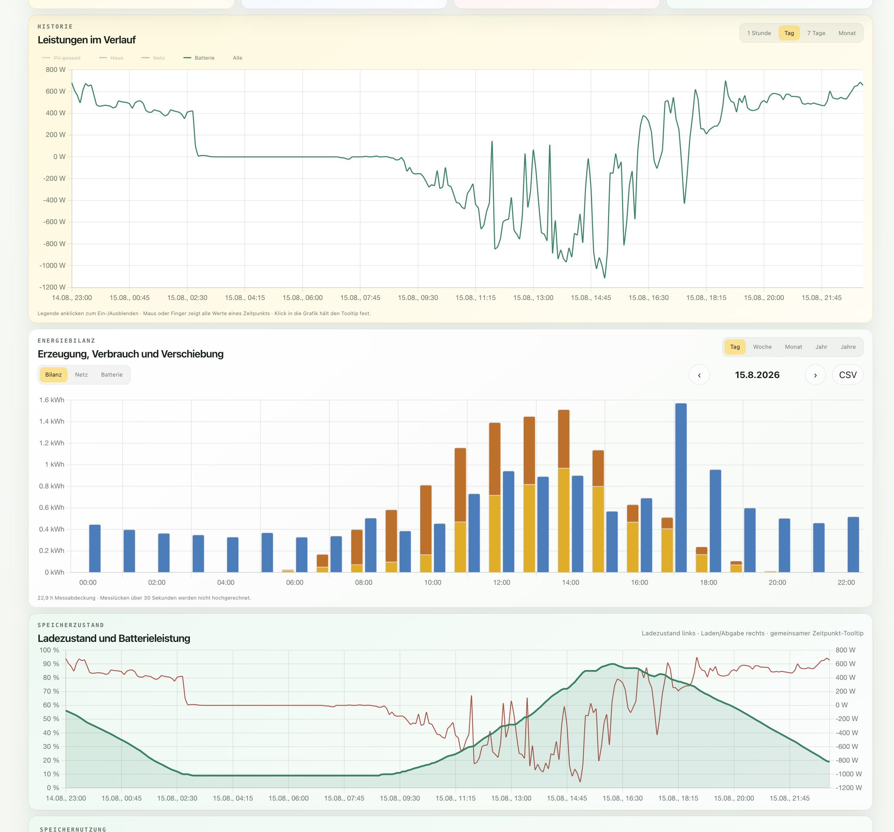
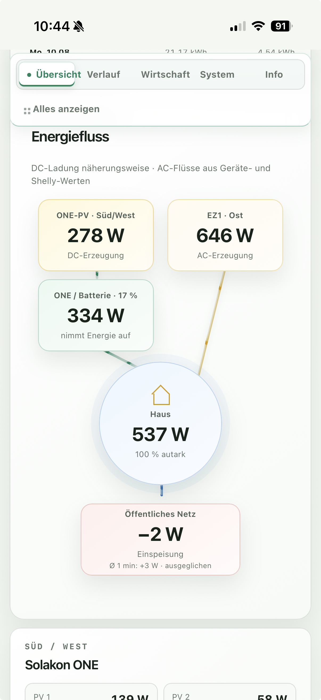
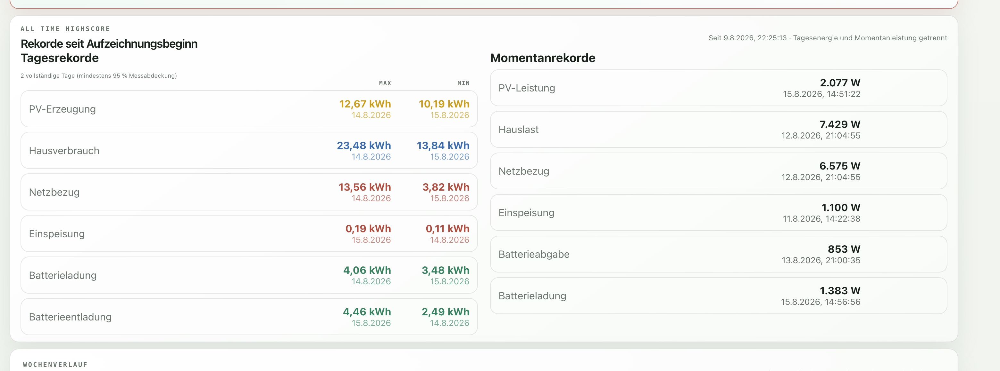

# PV Dashboard

[English version](README.en.md) · [Project website](https://mail896.github.io/pv-dashboard/)



Responsive, local-first energy dashboard for a Raspberry Pi 5. It combines a
Solakon ONE battery inverter, APsystems EZ1 microinverter, Shelly Pro 3EM and a
Tasmota smart-meter reader into one read-only view with five-second storage,
interactive charts, calendar-aware statistics and protected data exports.

## Highlights

- Live energy flow for PV, household load, grid and battery.
- SQLite history in WAL mode, normally sampled every five seconds.
- Interactive power charts and energy aggregation by day, week, month and year.
- Paginated seven-day statistics with URL state and incomplete-day markers.
- Paginated battery-day analysis and URL-persisted 30-row device-event pages.
- Weekly/monthly solar heatmaps and a compact annual yield view with monthly cards.
- Automatically invalidated SQLite cache for completed solar periods; raw samples remain unchanged.
- Battery state, charge/discharge energy, temperature and operating limits.
- Daily and instantaneous records with measurement-coverage checks.
- Calendar CSV plus ZIP-compressed raw export at 5 s, 1 min or 15 min resolution.
- Responsive desktop/mobile interface and local Chart.js bundle without CDN.
- Read-only device access: the application contains no inverter or battery controls.

## Screenshots

| Desktop | Mobile |
|---|---|
|  |  |
|  | |

More screenshots and architectural details are available on the
[GitHub Pages site](https://mail896.github.io/pv-dashboard/).

## Architecture

```text
Solakon ONE ─ Modbus TCP ─┐
APsystems EZ1 ─ HTTP API ─┤
Shelly Pro 3EM ─ RPC/HTTP ├─ FastAPI collector ─ SQLite/WAL ─ REST API
Tasmota IR ─ HTTP status ─┘                                  │
                                                             └─ HTML/CSS/JS + Chart.js
```

The collector polls sources concurrently. EZ1 power is deliberately limited to
a ten-second cadence and rare status endpoints to five minutes. Measurement gaps
over 30 seconds are not silently extrapolated in energy statistics.

## Quick start

```bash
git clone https://github.com/mail896/pv-dashboard.git
cd pv-dashboard
python3 -m venv .venv
.venv/bin/pip install -r requirements.txt
cp .env.example .env
# edit the example addresses
set -a; . ./.env; set +a
.venv/bin/uvicorn backend.main:app --host 127.0.0.1 --port 8000
```

Then open `http://127.0.0.1:8000/`. Production deployment should use the
included systemd unit and a reverse proxy with HTTPS.

## Documentation

- [Installation and operation](docs/INSTALL.md)
- [Architecture](docs/ARCHITECTURE.md)
- [API and exports](docs/API.md)
- [Data model and signs](docs/DATA_MODEL.md)
- [Security and publication boundaries](docs/SECURITY.md)

## Privacy and security

This public repository contains no production database, credentials, TOTP
secret, device identifiers, private addresses or deployment state. Addresses in
`.env.example` use the documentation-only `192.0.2.0/24` range.

CSV endpoints are ordinary application endpoints internally. If they are made
public, protect them at the reverse proxy with authentication and rate limiting;
the production-specific PAM/TOTP configuration is intentionally not shipped.

## Tests

```bash
.venv/bin/python -m unittest discover -s tests-python -v
```

The repository includes ten data and collector tests covering normalization,
calendar aggregation, gaps, battery statistics, derived-cache invalidation, records and storage round trips.

## License

MIT. Chart.js is bundled under its own MIT license; see
`frontend/chartjs-LICENSE.md`.
